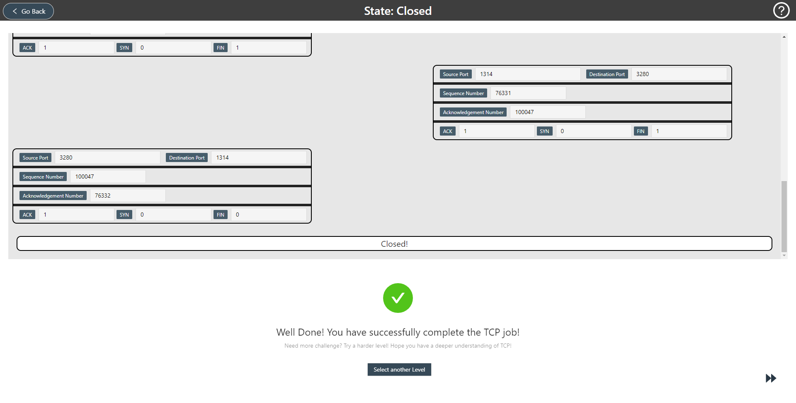

# TCP Adventure
> [PLAY NOW](tcp.huangyongjin.com)

Welcome to TCP Adventure, The first browser game dedicated to teaching TCP.

Highlights:
- Pure front-end website.
- Intelligent TCP bot.
- Step-by-step learning.

## Design
### Levels
- Easy level: aims to teach players to go through three TCP phases and learn some significant fields within TCP segment. The game mission is to send a SYN-ACK during connection establishment and a FIN-ACK during connection termination. 
- Medium level: 
- Hard level: 
### Gamification
- Achievement System
- Rating System
- Health System
## Contribution
- Design new levels as you like. Require Knowledge of [React](https://reactjs.org/).
- Add functionalities to the TCP bot. Require Knowledge of TCP and [XState](https://xstate.js.org/docs/).
